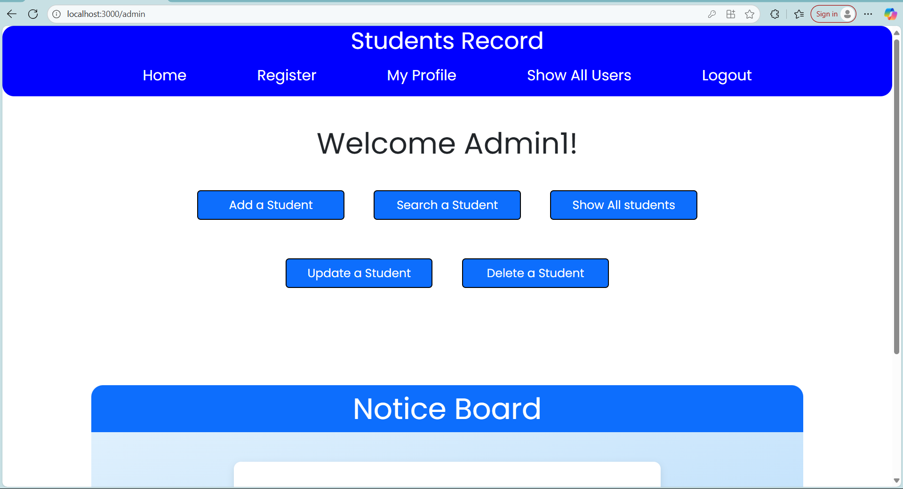
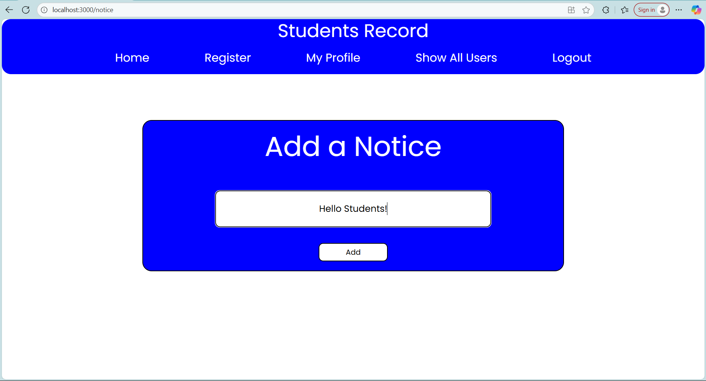
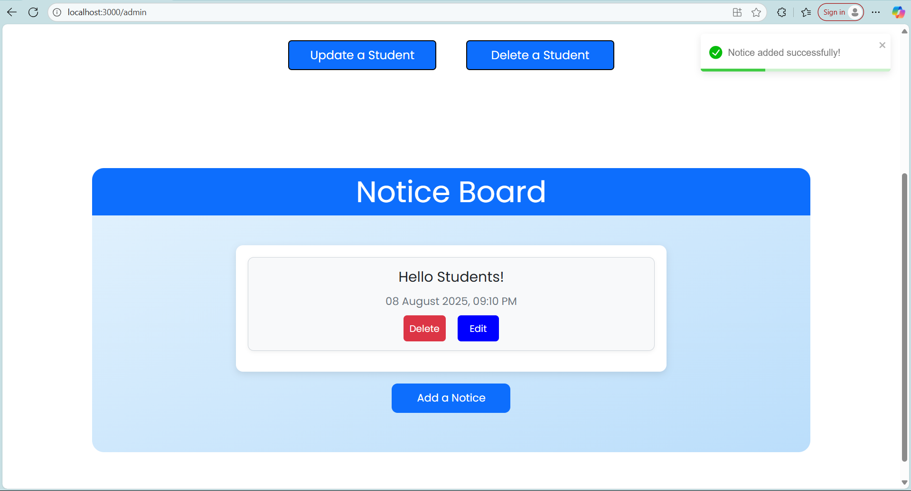
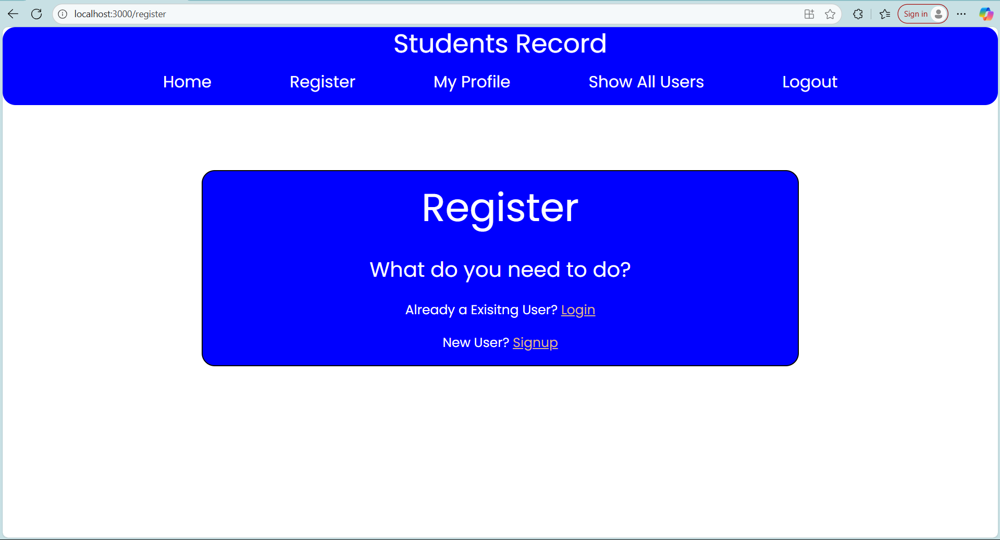
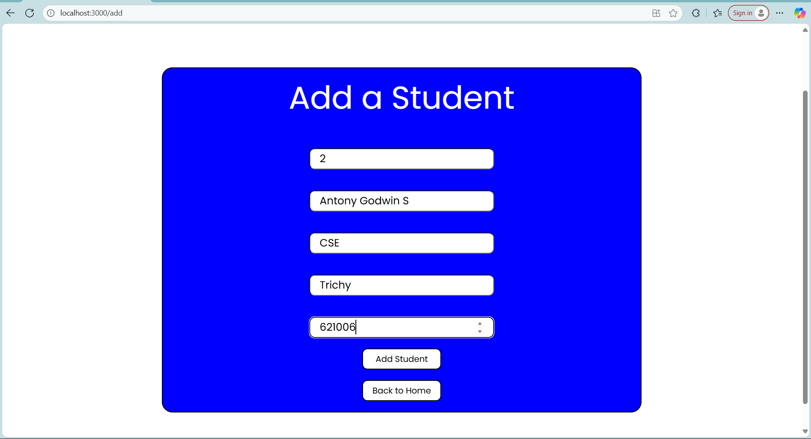
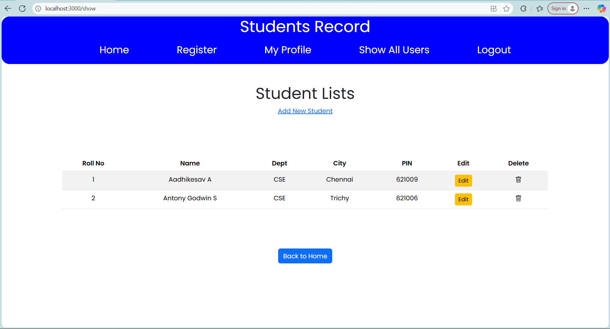

Student Management System (Full Stack – React, Express, MySQL)

Overview
A full-stack web application for managing students, users, and notices. Built with React.js (frontend), Express.js (backend API), MySQL (database), and modern security practices. Supports CRUD operations, JWT authentication, role-based access control (Admin/Student), input validation, rate limiting, and XSS prevention.

Features
User Authentication: Sign up, login, logout with JWT tokens and bcrypt password hashing.
Role-Based Access: Separate Admin and Student dashboards.
Student CRUD: Add, view, edit, delete, and search students.
User Management: View registered users (Admin only).
Notices: Post, view, edit, and delete announcements (Admin only).
Input Validation & Sanitization: Prevents SQL injection and XSS attacks.
Rate Limiting: Protects against brute force and abuse.
Responsive UI: Clean, modern interface built with React.
Error Handling: User-friendly feedback for validation, auth, and server errors.
Environment Variables: Secure configuration (database, JWT secret, etc.).

Tech Stack
Area	Technology
Frontend	React.js, react-router-dom, axios, react-toastify
Backend	Node.js, Express.js, mysql2, bcryptjs, jsonwebtoken, express-validator, express-rate-limit
Database	MySQL
Security	JWT, bcrypt, input sanitization, rate limiting, CORS
Development	dotenv, nodemon (optional)

Setup & Installation
1. Clone the Repository
git clone https://github.com/Antony-Godwin24/react-express-crud-students.git
cd react-express-crud-students

2. Backend Setup
cd server
npm install

Create .env file (see .env.example below) in server/:
DB_HOST=localhost
DB_USER=your_mysql_user
DB_PASSWORD=your_mysql_password
DB_NAME=students
JWT_SECRET=your_random_jwt_secret
JWT_EXPIRES_IN=2h
PORT=3500

Start backend server:
npm start
# Server runs on http://localhost:3500

3. Database Setup
Run this in your MySQL client:
CREATE DATABASE students;
USE students;

CREATE TABLE users (
  uname VARCHAR(200) NOT NULL PRIMARY KEY,
  email VARCHAR(100) NOT NULL UNIQUE,
  pass VARCHAR(200) NOT NULL
);

CREATE TABLE stdnts (
  roll INT NOT NULL PRIMARY KEY,
  name VARCHAR(100) NOT NULL,
  dept VARCHAR(100) NOT NULL,
  city VARCHAR(100) NOT NULL,
  pin CHAR(6) NOT NULL
);

CREATE TABLE notice (
  id INT NOT NULL AUTO_INCREMENT PRIMARY KEY,
  info VARCHAR(500) NOT NULL,
  Time DATETIME NOT NULL
);

4. Frontend Setup
cd ../client/stdnt-react
npm install

Start React app:
npm start
# App runs on http://localhost:3000

Project Structure
react-express-crud-students/
├── server/                # Express backend
│   ├── db/                # Database connection
│   ├── routes/            # API endpoints
│   ├── middleware/        # Auth, validation, sanitization
│   ├── .env               # Environment variables
│   └── server.js          # Main entry point
├── client/stdnt-react/    # React frontend
│   ├── src/
│   │   ├── components/    # Reusable UI components
│   │   ├── pages/         # Main views (Login, Signup, Admin, Student)
│   │   ├── App.js         # Routing and layout
│   │   └── ...            # Other React setup
│   └── package.json
└── README.md              # This file

Security Practices
Secrets in .env: Never commit credentials or JWT secrets to Git.
JWT Authentication: Tokens expire, roles enforced, no hardcoded secrets.
Input Validation: All API inputs validated with express-validator.
Input Sanitization: Removes <script>, javascript:, and event handlers from user inputs.
Parameterized Queries: Prevents SQL injection.
Rate Limiting: Blocks brute force attacks (5 login/signup attempts per 15 min).
CORS: Configured for development (adjust for production).
Error Handling: Clear messages for validation, auth, and server errors.

Screenshots 

API Documentation
Endpoint	Method	Description	Auth Required	Role
/signup	POST	Register new user	No	-
/login	POST	Log in, get JWT token	No	-
/students	GET	List all students	Yes	Admin
/students	POST	Add new student	Yes	Admin
/students/:roll	PUT	Update student by roll	Yes	Admin
/students/:roll	DELETE	Delete student by roll	Yes	Admin
/students/search	GET	Search students by name	Yes	Admin
/notice	POST	Add notice (Admin)	Yes	Admin
/notice	GET	List all notices	Yes	Both
/notice/:id	PUT	Update notice by ID	Yes	Admin
/notice/:id	DELETE	Delete notice by ID	Yes	Admin
/getUsers	GET	List all users (Admin)	Yes	Admin

See server code for full details on request/response formats and validation rules.

Environment Variables (.env)
# Database
DB_HOST=localhost
DB_USER=your_mysql_user
DB_USER=root
DB_PASSWORD=your_mysql_password
DB_NAME=students

# JWT
JWT_SECRET=your_random_64_bytes_secret
JWT_EXPIRES_IN=2h

# Server
PORT=3500

Contributing
1.Fork the repository.
2.Create a new feature branch (git checkout -b feature/your-feature).
3.Commit your changes (git commit -am 'Add some feature').
4.Push to the branch (git push origin feature/your-feature).
5.Open a Pull Request.
Report bugs or suggest features via GitHub Issues.

License
Specify your license here (e.g., MIT).

Contact
Your Name – [Your Email] – [Your LinkedIn/GitHub]
Project Link: https://github.com/Antony-Godwin24/react-express-crud-students

Acknowledgments
React, Express, MySQL communities
ZOHO Corporation (for internship experience)
Create React App (for project scaffolding)
Toastify, Axios, bcrypt, JWT (for critical libraries)

This README gives recruiters, collaborators, and users everything needed to understand, run, and appreciate your project.
Keep it updated as you add features or improve security.
Good luck with your internship and job search—you’re building strong, recruiter-ready full-stack skills!